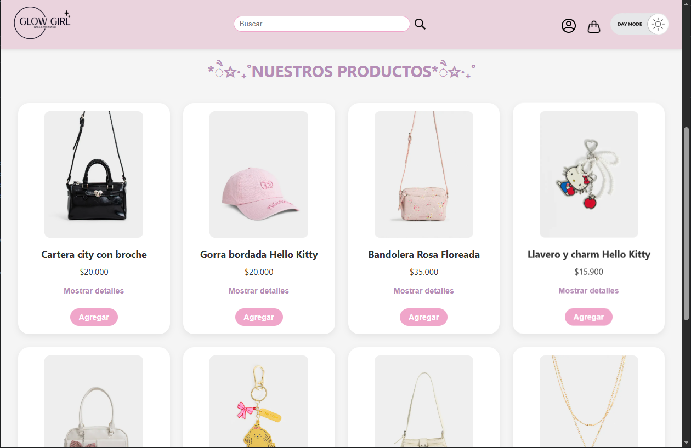
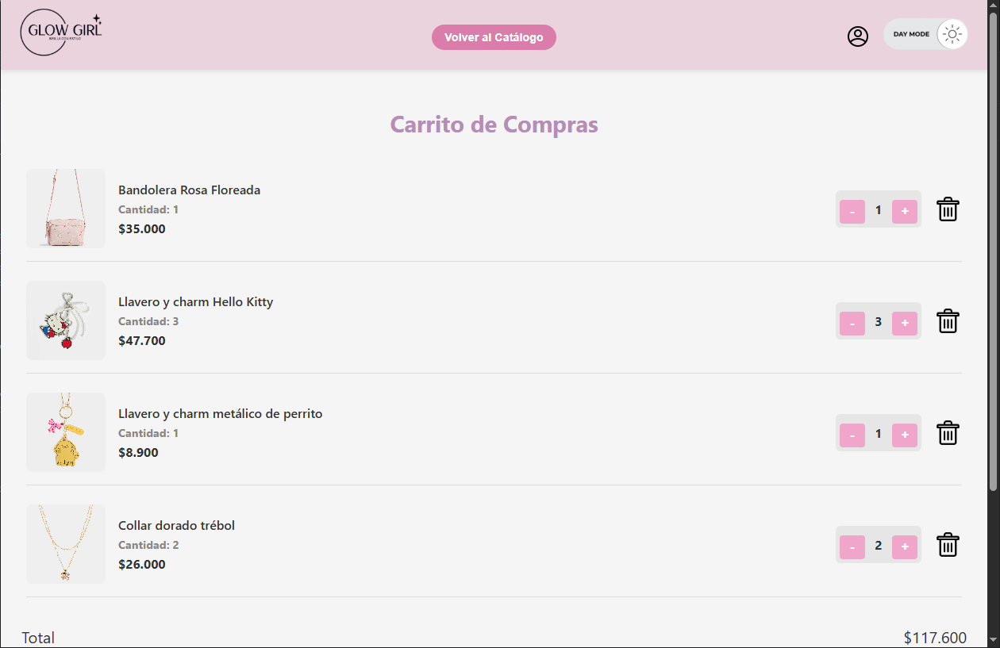
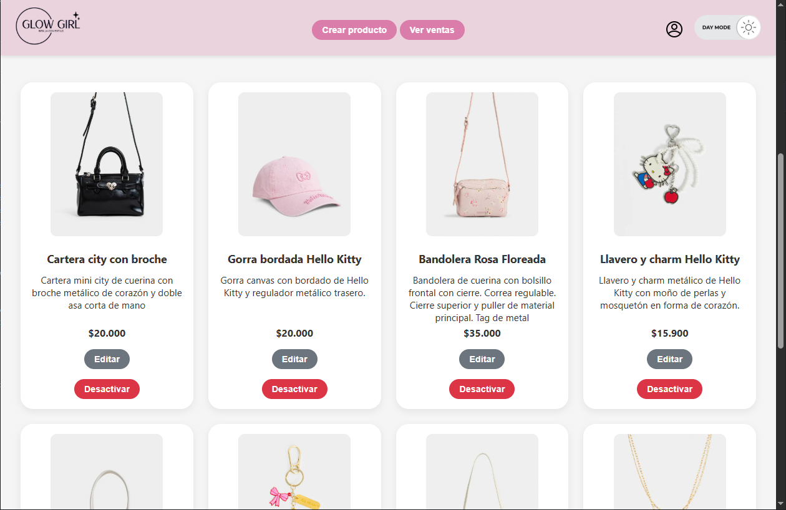
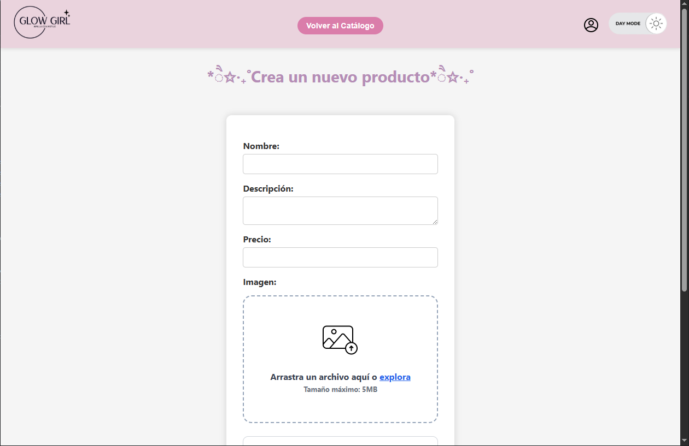

<h1>Glow Girl - Admin and Product Catalog</h1>
Glow Girl is a product catalog and management project, developed with Node.js, Express, Sequelize and EJS, that allows you to buy and manage products.

<h2>🖼️ Screenshots</h2>

  
  
  
  

<h2>⚠️ Before executing the project</h2>

<h3>1. Database and tables</h3>
  <ul>
    <li>Create a database (in this project we use mysql)</li>
    <li>Create the tables (you can find the models in 'backend/sql')</li>
    <li>Insert the products (you can find them in 'backend/sql/products.sql')</li>
  </ul>

<h3>2. Env</h3>
  <ul>
    <li>Copy the '.env.example' file and rename it to '.env'</li>
    <li>Fill in your actual database data</li>
  </ul>

<h3>3. Dependencies</h3>
  <ul>
    <li>Open a terminal in 'backend' and type 'npm i'</li>
  </ul>

<h2>🚀 Run the project</h2>
  <ul>
    <li>Open a terminal in 'backend' and type 'npm start'</li>
  </ul>

<h2>⚠️ Attention</h2>
Creating administrator users must be done from a Postman (in this case, we use Thunder Client). If there are no users, you won't be able to access the administrator catalog.

<h2>⚙️ Features</h2>
<ul>
  <li>Customer and admin login</li>
  <li>Create products with images</li>
  <li>Edit existing products</li>
  <li>Activate/Deactivate products</li>
  <li>Product pagination and search</li>
  <li>Dark mode</li>
  <li>Cart</li>
</ul>
